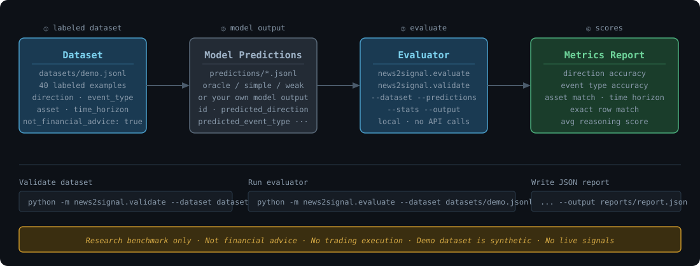

# News2Signal Bench by Catalayer

> **Most AI models can summarize market news. Fewer can turn it into structured signals.**

News2Signal Bench is an open benchmark for evaluating whether AI models can understand market-moving news and convert it into structured signal labels such as direction, event type, asset relevance, time horizon, and reasoning quality.

It is built for research, model evaluation, and financial news understanding — not trading execution.



---

## What is News2Signal Bench?

Financial news reasoning requires more than summarization. A model needs to:

1. Identify the primary affected asset
2. Classify the type of market event
3. Assign a directional impact — bullish, bearish, neutral, or mixed
4. Select the appropriate time horizon
5. Explain its reasoning

News2Signal Bench provides a labeled dataset, a schema, an evaluator, and reference predictions so you can measure exactly how well a model performs on this task.

---

## How to use this benchmark

News2Signal Bench is a CLI-based benchmark and evaluation harness. It does not call model APIs by itself.

To evaluate a model:

1. Use `datasets/demo.jsonl` as the labeled benchmark dataset.
2. Ask your model to produce predictions in the required JSONL format.
3. Save those predictions as a `.jsonl` file.
4. Run the evaluator against the dataset and prediction file.
5. Compare the model's score against the included baselines.

The included prediction files serve different purposes:

- `oracle_baseline.jsonl` is a sanity check that mirrors the labels and should score 100%.
- `simple_baseline.jsonl` is the main demo baseline and is intentionally imperfect.
- `weak_baseline.jsonl` demonstrates common failure modes.

This project is a benchmark, not a web interface. There is no UI in v0.1.1.

---

## Why this exists

Existing financial NLP benchmarks often test sentiment classification on headlines in isolation. News2Signal Bench is designed around structured signal prediction — a harder and more useful task.

It is also designed to naturally surface where models fail: on neutral cases (where no repricing is warranted), on mixed cases (where competing signals are in genuine tension), and on time horizon reasoning (which requires domain knowledge about implementation lags and market pricing speed).

---

## What it evaluates

| Dimension | Description |
|-----------|-------------|
| **Direction Accuracy** | Does the model correctly classify bullish / bearish / neutral / mixed? |
| **Event Type Accuracy** | Does the model identify the correct market event category? |
| **Asset Match Accuracy** | Does the model identify the correct primary asset? |
| **Time Horizon Accuracy** | Does the model select the correct signal time window? |
| **Exact Row Match** | Are all four dimensions correct simultaneously? |
| **Reasoning Quality** | Average self-reported reasoning score (1–5, optional) |
| **Coverage** | What fraction of the dataset does the model predict on? |

---

## Quick Start

Clone the repository:

```bash
git clone https://github.com/stephenywilson/News2SignalBench
cd News2SignalBench
```

Create a virtual environment and install locally:

```bash
python -m venv .venv
source .venv/bin/activate
pip install -e .
```

From the repository root, run the following commands:

Validate the demo dataset:

```bash
python -m news2signal.validate --dataset datasets/demo.jsonl
```

Print dataset stats:

```bash
python -m news2signal.validate --dataset datasets/demo.jsonl --stats
```

Validate predictions:

```bash
python -m news2signal.validate --predictions examples/predictions/simple_baseline.jsonl
```

Run the evaluator with the main demo baseline:

```bash
python -m news2signal.evaluate \
  --dataset datasets/demo.jsonl \
  --predictions examples/predictions/simple_baseline.jsonl
```

Write a JSON report:

```bash
python -m news2signal.evaluate \
  --dataset datasets/demo.jsonl \
  --predictions examples/predictions/simple_baseline.jsonl \
  --output reports/simple-baseline-report.json
```

Run the full smoke test:

```bash
bash scripts/smoke_test.sh
```

### Included prediction files

| File | Purpose |
|------|---------|
| `examples/predictions/simple_baseline.jsonl` | Main demo baseline — plausible model-style predictions (~65% direction accuracy) |
| `examples/predictions/oracle_baseline.jsonl` | Sanity-check oracle — mirrors labels exactly, should always score 100% |
| `examples/predictions/weak_baseline.jsonl` | Failure-mode example — shows what systematic misclassification looks like |

---

## Dataset Format

Each row in `datasets/demo.jsonl` is a JSON object with these fields:

```json
{
  "id": "demo-0001",
  "headline": "Fed Chair signals rate cuts likely at next meeting as inflation eases",
  "summary": "The Federal Reserve chair indicated...",
  "asset": "SPY",
  "asset_type": "equity_index",
  "sector": "macro",
  "event_type": "central_bank",
  "expected_direction": "bullish",
  "time_horizon": "short_term",
  "confidence_label": "high",
  "reasoning": "A clear signal of rate cuts reduces the discount rate...",
  "not_financial_advice": true
}
```

**Allowed values:**

| Field | Values |
|-------|--------|
| `expected_direction` | `bullish` `bearish` `neutral` `mixed` |
| `time_horizon` | `intraday` `short_term` `medium_term` `long_term` |
| `confidence_label` | `low` `medium` `high` |
| `event_type` | `central_bank` `inflation` `earnings` `guidance` `regulatory` `geopolitical` `supply_chain` `labor_market` `merger_acquisition` `product_launch` `credit_risk` `commodity` `crypto_policy` `housing` `consumer_demand` `fiscal_policy` |
| `asset_type` | `equity` `equity_index` `bond` `fx` `commodity` `crypto` `sector_etf` `macro_proxy` |

Full schema: [`schema/news_signal.schema.json`](schema/news_signal.schema.json)

---

## Prediction Format

Each row in a predictions file should match a dataset `id` and include:

```json
{
  "id": "demo-0001",
  "predicted_direction": "bullish",
  "predicted_event_type": "central_bank",
  "predicted_asset": "SPY",
  "predicted_time_horizon": "short_term",
  "reasoning_score": 5,
  "reasoning": "A clear Fed signal of rate cuts..."
}
```

`reasoning_score` and `reasoning` are optional. All other fields are required.

---

## Metrics

### Main demo baseline (`simple_baseline.jsonl`)

Designed to behave like a plausible but imperfect model: strong on obvious signals, weaker on neutral and mixed cases.

```
============================================================
  News2Signal Bench — Evaluation Report
============================================================
  Predictions : examples/predictions/simple_baseline.jsonl

  Dataset rows      : 40
  Prediction rows   : 40
  Matched rows      : 40

  Coverage          : 100.0%  [========================================]
  Direction Acc.    :  62.5%  [=========================               ]
  Event Type Acc.   :  82.5%  [=================================       ]
  Asset Match Acc.  :  87.5%  [===================================     ]
  Time Horizon Acc. :  52.5%  [=====================                   ]
  Exact Row Match   :  32.5%  [=============                           ]
  Avg Reasoning     :   3.50 / 5.00

============================================================
  NOTE: This is a research benchmark. Not financial advice.
============================================================
```

### Oracle baseline (`oracle_baseline.jsonl`) — sanity check only

Mirrors the dataset labels exactly and is intended to verify that the evaluator is working correctly. It should always score 100%.

```
  Direction Acc.    : 100.0%
  Event Type Acc.   : 100.0%
  Asset Match Acc.  : 100.0%
  Time Horizon Acc. : 100.0%
  Exact Row Match   : 100.0%
  Avg Reasoning     :   4.53 / 5.00
```

**Note:** The oracle baseline is not a real model baseline. It scores 100% by design. Use it to confirm the evaluator is correctly reading your dataset and predictions files.

### Weak baseline (`weak_baseline.jsonl`) — failure-mode example

Shows systematic misclassification patterns — correctly identifies event types but fails on direction and time horizon:

```
  Direction Acc.    :  12.5%
  Event Type Acc.   :  70.0%
  Asset Match Acc.  :  90.0%
  Time Horizon Acc. :  12.5%
  Exact Row Match   :   0.0%
  Avg Reasoning     :   1.98 / 5.00
```

This illustrates a key insight: event type recognition (what kind of news is this?) is structurally easier than directional reasoning (what does it mean for prices?).

---

## What v0.1.1 includes

- `datasets/demo.jsonl` — 40 balanced synthetic labeled examples (10 each: bullish / bearish / neutral / mixed); all 16 event types covered; all 4 time horizons covered including `long_term`
- `news2signal/` — Python evaluation package (no external dependencies)
- `examples/predictions/simple_baseline.jsonl` — main demo baseline (~62% direction accuracy)
- `examples/predictions/oracle_baseline.jsonl` — sanity-check oracle (should always score 100%)
- `examples/predictions/weak_baseline.jsonl` — failure-mode example
- `examples/prompts/baseline_prompt.md` — prompt template used to generate predictions
- `schema/news_signal.schema.json` — JSON Schema definition
- `docs/` — labeling guide, metric explanations, dataset card
- `scripts/smoke_test.sh` — end-to-end smoke test

---

## What this is not

- **Not financial advice.** The dataset, predictions, and evaluation scores are research artifacts only.
- **Not a trading bot.** There is no execution layer, no live data, and no trade generation.
- **Not a live signal provider.** All examples are synthetic and have no real-time market connection.
- **Not a recommendation system.** Benchmark scores do not translate to investment performance.
- **Not a proprietary Catalayer dataset.** The demo dataset is fully synthetic and contains no private data.

---

## Future Work

News2Signal Bench v0.1.1 is a framework demonstration release. Future versions may explore:

- Larger synthetic and human-reviewed datasets
- More examples per event type and asset type
- Partial-credit scoring for adjacent time horizons
- A clearer reasoning-quality rubric
- Multi-asset and cross-asset impact labels
- Optional leaderboard or community-submission workflow

---

## License

Apache 2.0. See [LICENSE](LICENSE).

© 2024-2026 Catalayer AI
